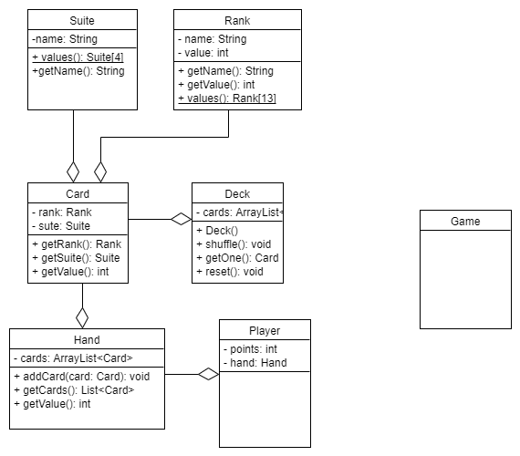

# Домашнее задание

Используя инструмент http://www.umletino.com/umletino.html 
продолжить писать диаграмму классов (https://www.visual-paradigm.com/guide/uml-unified-modeling-language/uml-class-diagram-tutorial/)
для игры BlackJack

1. Описать необходимые поля и методы класса Player
2. Описать необходимые поля и методы класса Game
3. При необходимости описать другие классы и указать отножения между ними

Прислать на проверку файлы с изображением и диаграммой в формате *.uxf

Диаграмма с занятия [загрузить](diagram.uxf)

